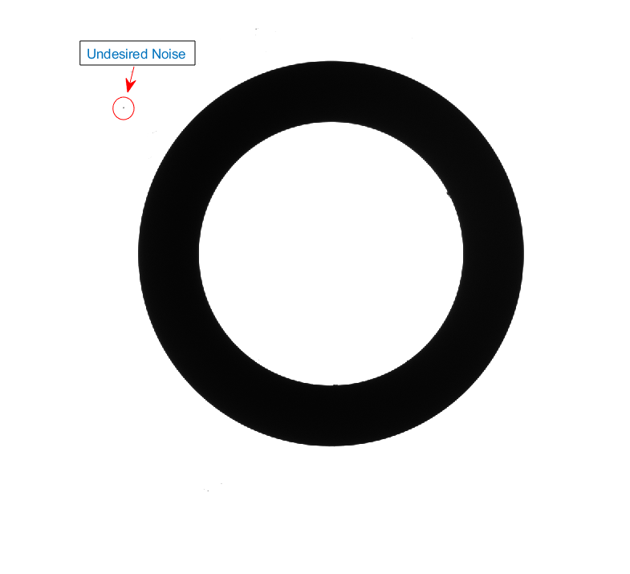
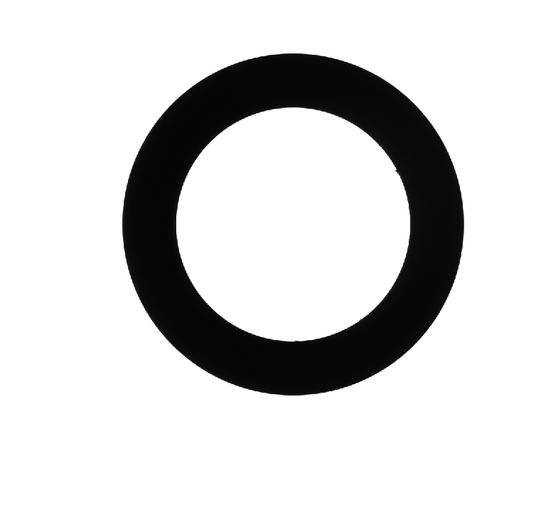

# 💡⚙️📐 Subpixel Counting-Based Diameter Measurement (MATLAB)

This repository contains a MATLAB implementation of a **Subpixel Counting-Based Diameter Measurement Algorithm for Industrial Machine Vision**, which is capable of estimating the outer diameter of circular objects using both synthetic and real grayscale images.

The method is particularly useful for machine vision applications requiring **high-precision measurements** under challenging imaging conditions (e.g., low resolution, blur).

---

## 🔍 Features

- Subpixel-level diameter estimation
- Automatic or manual calibration
- Suitable for both synthetic and real-world images
- Compatible with blurred images (e.g., Gaussian blur)
- Modular design with preprocessing and calibration options

---

## 🚀 Usage

```matlab
clear all
clc
addpath(genpath('.'));
```

📌 **Measuring Diameter in Synthetic Image**
```matlab
im = imread('synthetics/yeni_30_255_25_gauss_0.5bmp');
result = subpixel_counting_method(im, 'intermediate', 9, 'mean');
```
`numberofmaxk` = 9: Maximum number of transitions to consider (called n value in the paper)\
`intermediate`: Derivative-based edge method\
`mean`: Averaging type

🧹 **Preprocessing Step**

In the preprocessing step, objects in the image are detected using a connected component-based algorithm. It is assumed that the largest connected component corresponds to the actual workpiece. All other components (typically noise or irrelevant objects) are removed from the image.
The removed areas are then filled with background values to restore image consistency and prepare the data for accurate diameter estimation.

**Input Image:**



**After Preprocessing:**




📌 **Measuring Diameter in Real Image (with preprocessing)**
```matlab
th = 254;
im = imread('real/im_real.bmp');

% Preprocessing (Recommended)
im_desired = eliminate_small_objects(im, th);
im_filled = imcomplement(imfill(imcomplement(im_desired)));

result2 = subpixel_counting_method(im_filled, 'intermediate', 9, 'mean');
```

🧠 **Main Function Overview**
```matlab
subpixel_counting_method(im, edge_method, numberofmaxk, average_type)
```
`im`: Input grayscale image\
`edge_method`: Type of derivative method ('intermediate')\
`numberofmaxk`: Number of maximum transitions to be considered (can be auto)\
`average_type`: 'mean' or 'median' based averaging strategy\
This function internally:\
Computes intensity thresholds using edge-based analysis.\
Applies subpixel estimation using calculated bounds.\
Returns the estimated outer diameter.

🛠️ **Calibration Options**

You may use either:

`determine_thresholds(...)`: Fully automatic threshold detection

`determine_thresholds_with_manual_k(...)`: Manual control via numberofmaxk

If manual control is desired, see `calibration_for_subpixel_counting.m`.

📜 **License**

This project is licensed under the MIT License.

👤 **Author**

Developed by Ahmet Gökhan Poyraz

## 📚 Academic Background

This project is based on research conducted in the field of industrial image-based measurement using machine vision techniques. The algorithm has been formally published in a peer-reviewed journal:

> **Poyraz, Ahmet Gökhan, et al.**  
> *"Sub-Pixel counting based diameter measurement algorithm for industrial Machine vision."*  
> Measurement 225 (2024): 114063.  
> [https://doi.org/10.1016/j.measurement.2023.114063](https://doi.org/10.1016/j.measurement.2023.114063)

---

## 📖 Citation

If you use this work in your research, please cite the following publication:

```bibtex
@article{poyraz2024sub,
  title={Sub-Pixel counting based diameter measurement algorithm for industrial Machine vision},
  author={Poyraz, Ahmet G{\"o}khan and Ka{\c{c}}maz, Mehmet and G{\"u}rkan, Hakan and Dirik, Ahmet Emir},
  journal={Measurement},
  volume={225},
  pages={114063},
  year={2024},
  publisher={Elsevier}
}
